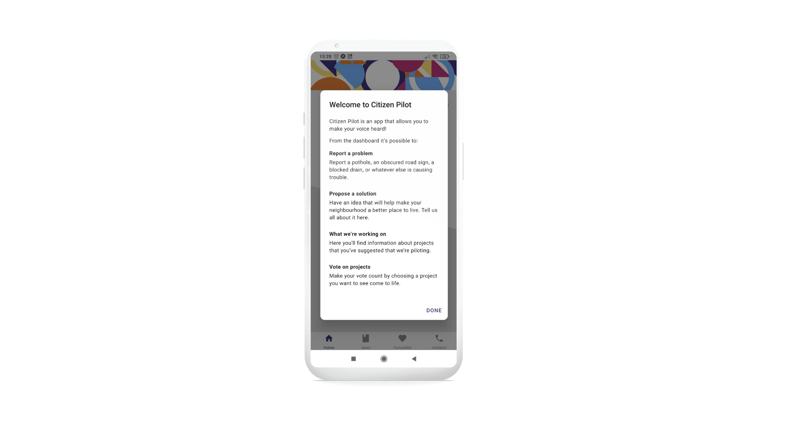
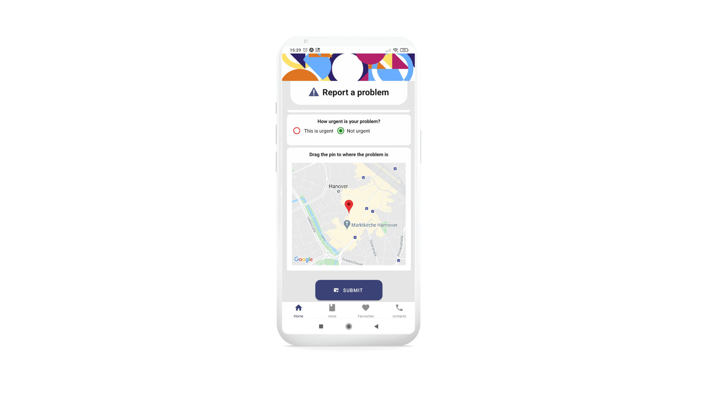

# Citizen-Pilot

<p align="center">
  
</p>

> Increasing citizen participation in developing nations.

---

## Table of Contents

- [Description](#description)
- [Getting Started](#getting-started)
- [Screenshots](#screenshots)
- [Technologies](#technologies)
- [Contributors](#contributors)

---

## Description

Citizen Pilot is a software application for developing countries with the aim of improving citizen participation. The mobile application (Android) encourages its users to propose solutions, vote on projects and report problems to their city councils while also gaining access to news and events organised by their governments (via the web application).

---

## Getting Started

Getting started

1. This Project is spread across 3 repos clone the following

   ```
   git clone https://github.com/hmar13/Citizen-Pilot
   ```

   ```
   git clone https://github.com/djolosc/citizen-pilot-webApp.git
   ```

   ```
   git clone https://github.com/hmar13/citizen-pilot-s.git
   ```

2. cd to root file

3. Install dependencies
   ```
   npm install
   ```
4. Start server from https://github.com/hmar13/citizen-pilot-s.git
   ```
   npm run start :dev
   ```
5. Start Mobile app
   ```
   npm start
   ```
6. Start Web App
   ```
   npm Start
   ```
7. Scan the barcode with the Expo app on your phone or follow the terminal instructions to load up the emulator on your machine.

### [Back to the top](#citizen-pilot)

---

## ScreenShots

<p float='left'>
  
  
  
  
</p>

## Technologies

- [React Native](https://facebook.github.io/react-native) - Front end library for building user interfaces
- [React](https://react.org) - Front end library for building user interfaces
- [Typescript](https://www.typescriptlang.org) - JavaScript Library
- [Redux](https://redux.js.org) - Storage to share data inside the app
- [Expo](https://expo.io) - Build cross-platform native apps
- [Firebase](https://firebase.google.com) - Realtime database and authentication
- [Postgres](https://www.postgresql.org) - Back end Database
- [Nestjs](https://nestjs.com) - A progressive Node.js framework for building efficient, reliable and scalable server-side applications.
- [Sequelizejs](https://sequelize.org) - A promise-based Node.js ORM for Postgres,
- [Docker](https://www.docker.com) - Speeding up configuration, information sharing and version control

---

## Contributors

Corona Laufer - [GitHub](https://github.com/Corona-L) - [Linkedin](https://www.linkedin.com/in/corona-laufer/)

Haydn Martin - [GitHub](https://github.com/hmar13) - [Linkedin](https://www.linkedin.com/in/haydnmartin/)

Đorđe Simović - [GitHub](https://github.com/djolosc) - [Linkedin](https://www.linkedin.com/in/djsimovic/)

Matthew Dodsworth - [GitHub](https://github.com/Mdods) - [Linkedin](https://www.linkedin.com/in/matthew-dodsworth-51a40883/)

---

### [Back to the top](#citizen-pilot)
